# Fundamentals of Parallelism on Intel Architecture
## 1. week 1
### 1.1 Progreso
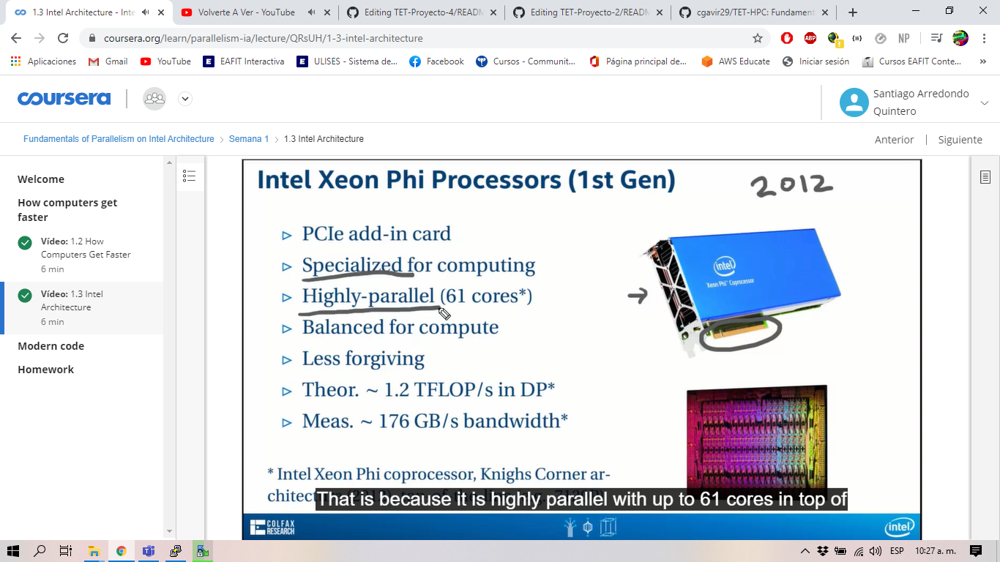
### 1.2 Quiz
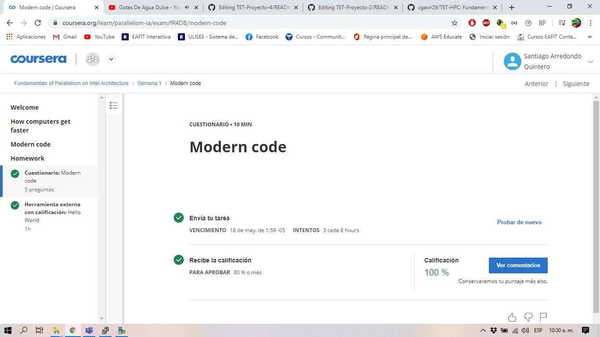
### 1.3 Laboratorio y ejercicios
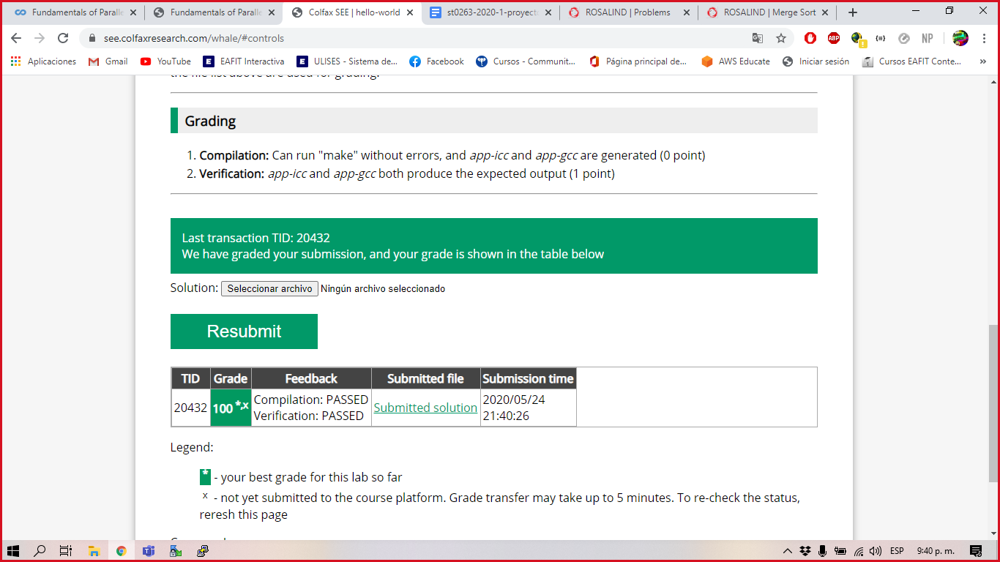
### 1.4 Finalización
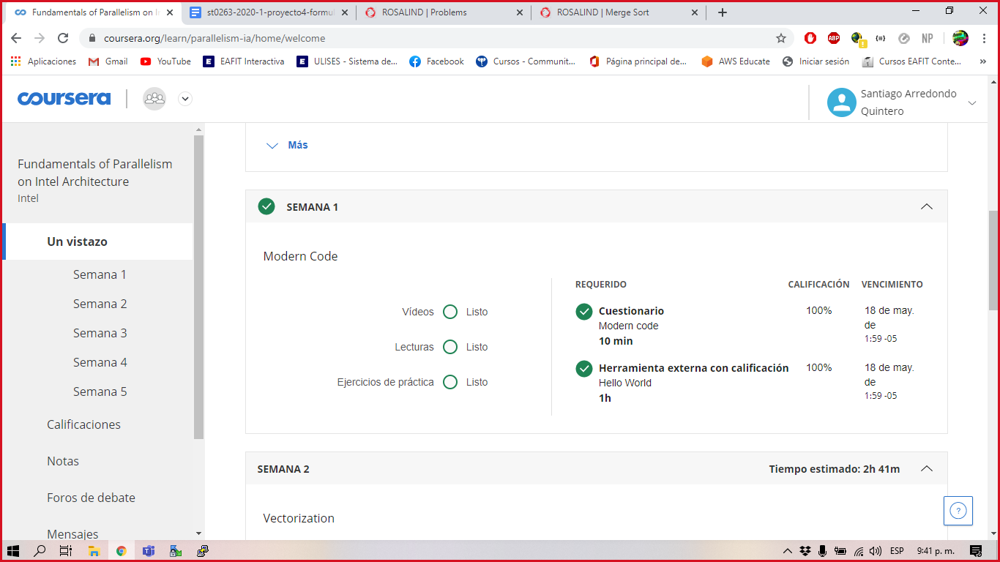
## 2. week 3
### 2.1 Progreso
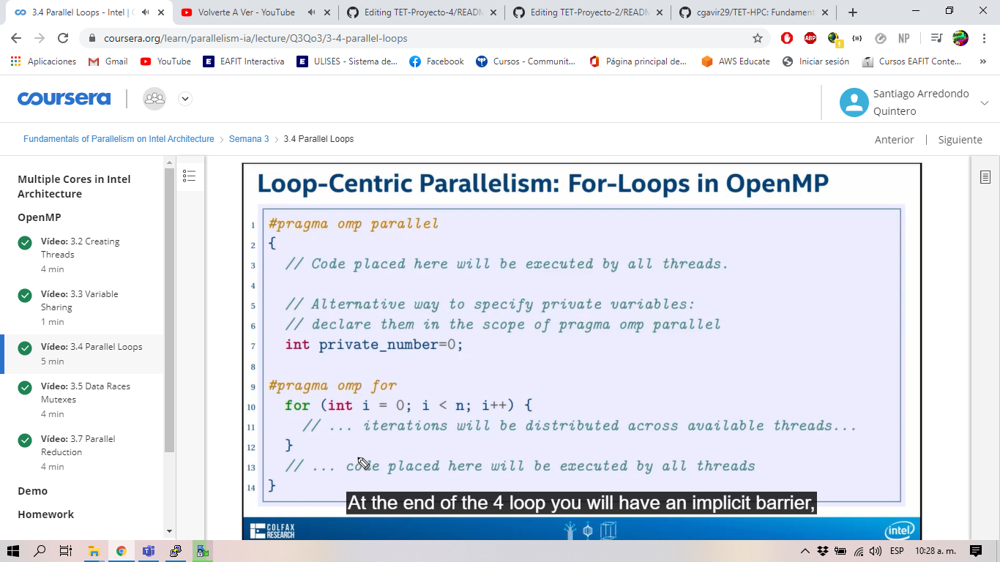
### 2.2 Quiz

### 2.3 Laboratorio y ejercicios
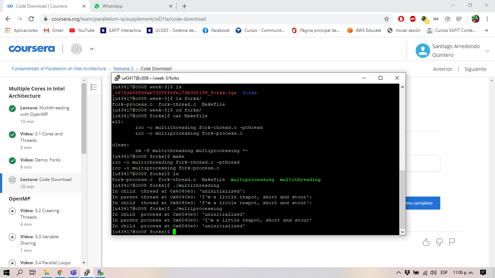
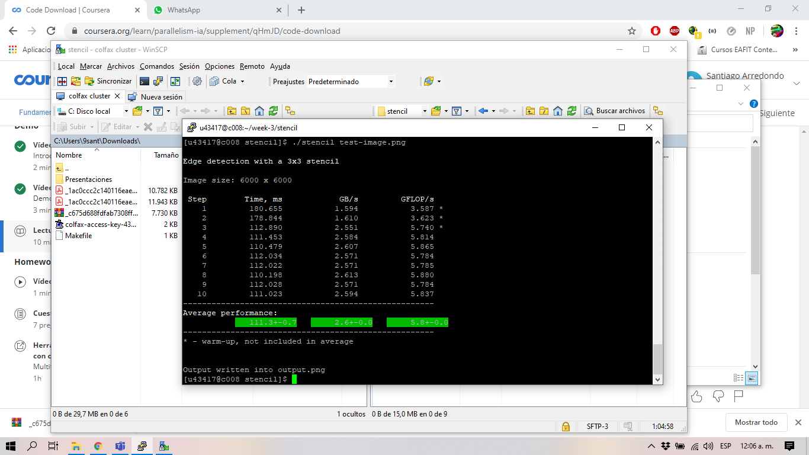
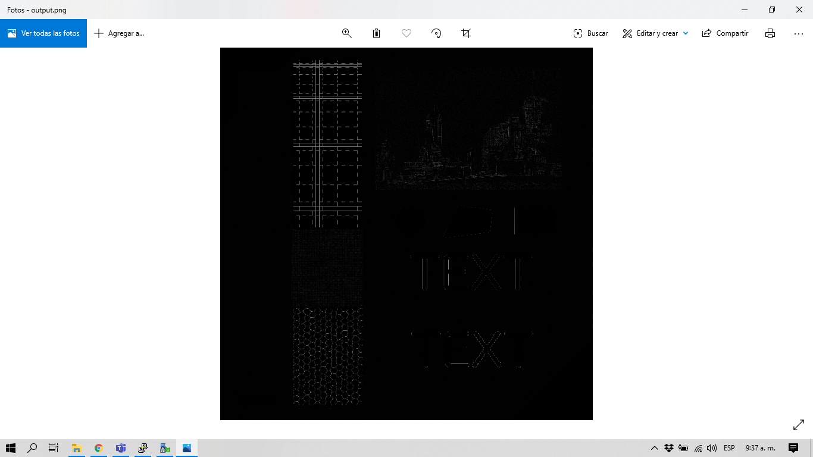
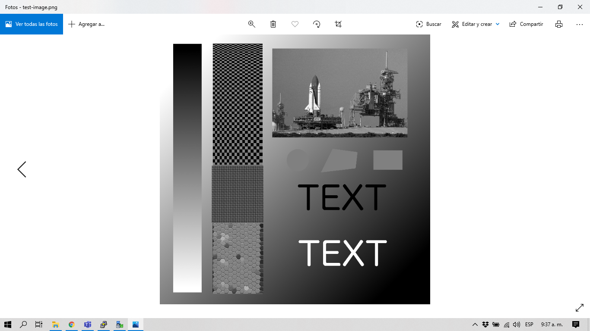
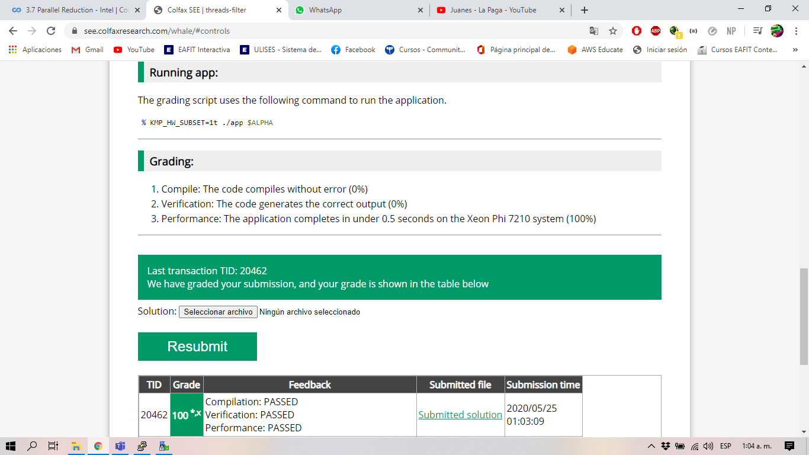
### 2.4 Finalización
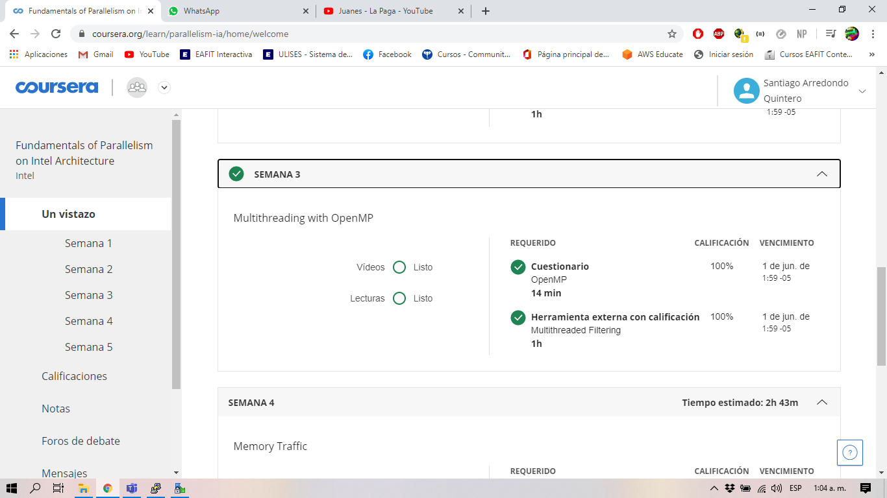
## 3. week 5
### 3.1 Progreso
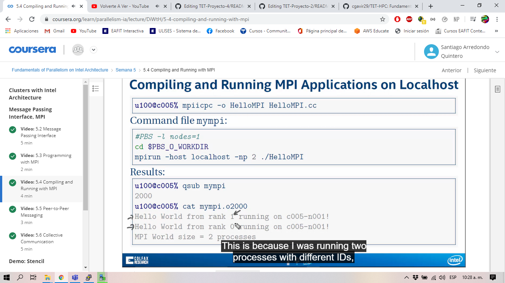
### 3.2 Quiz
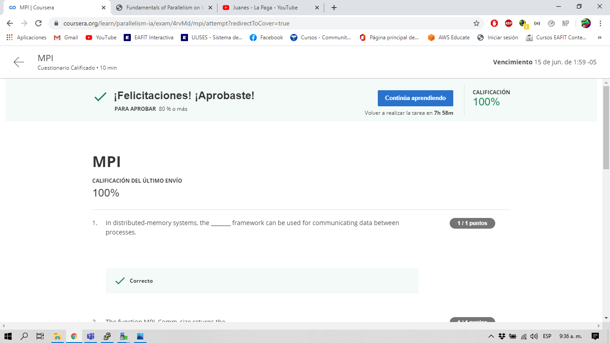
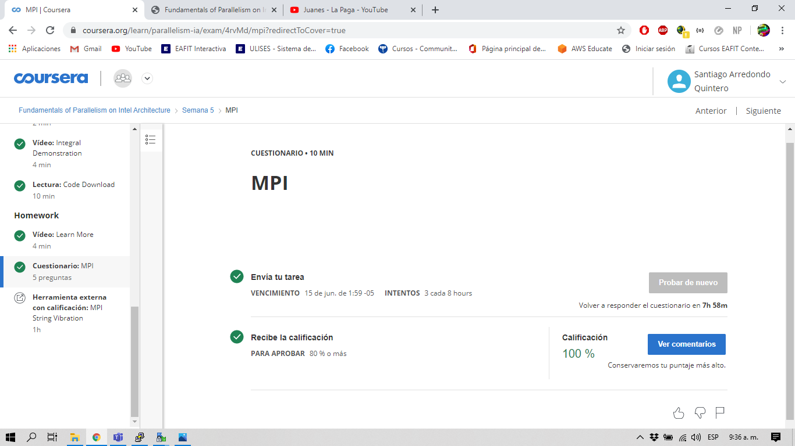
### 3.3 Laboratorio y ejercicios

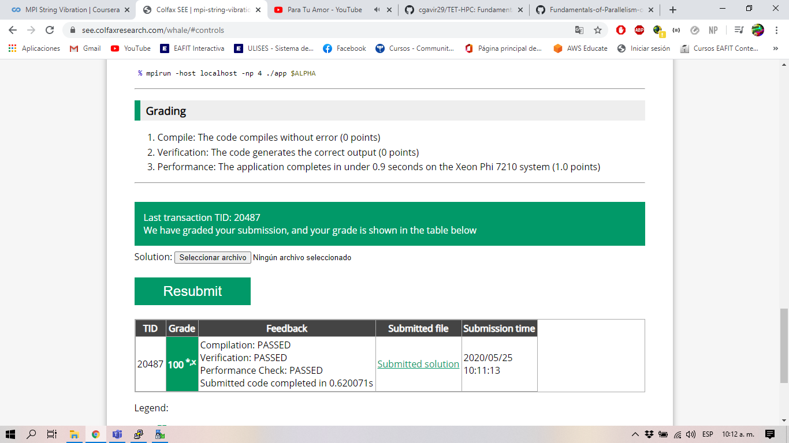
### 3.4 Finalización
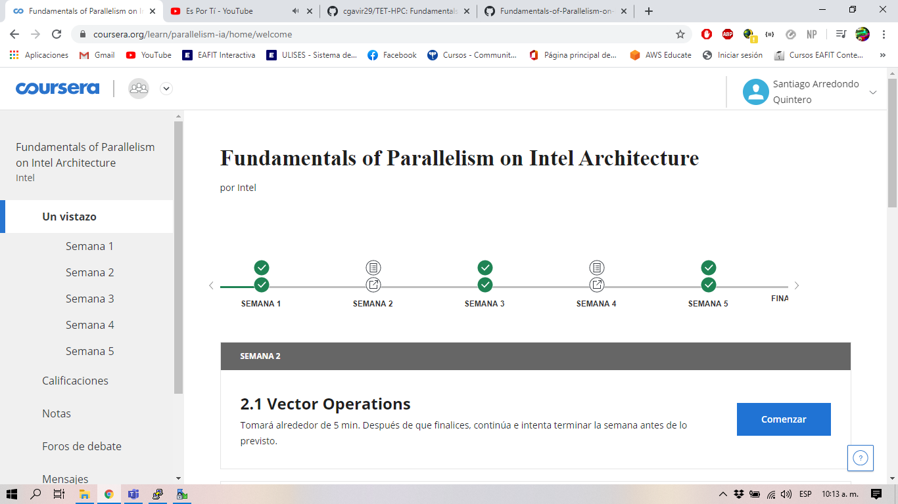
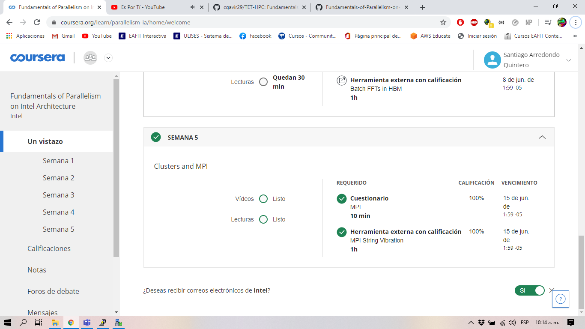